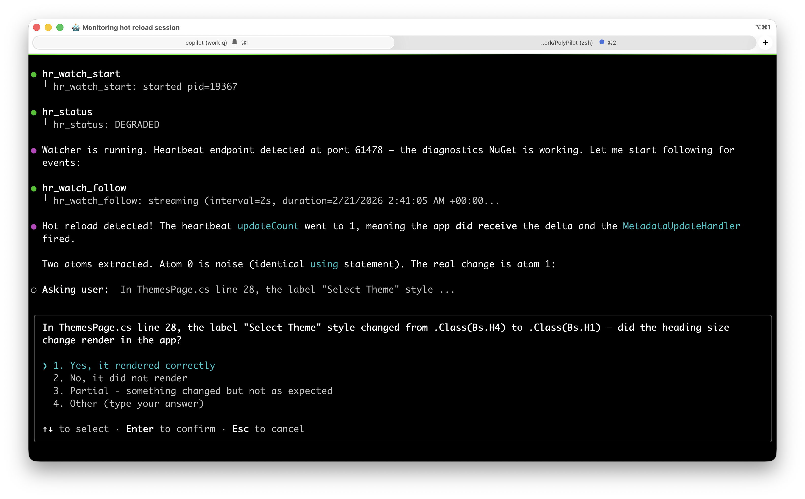
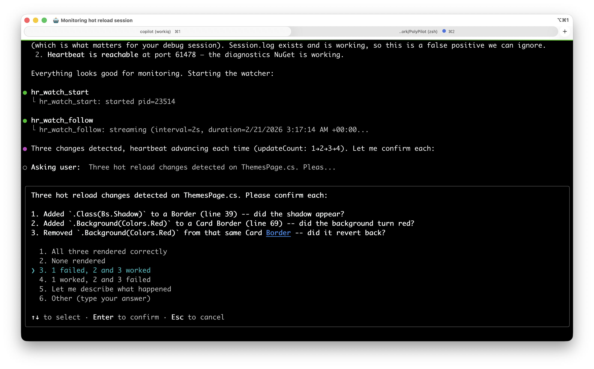
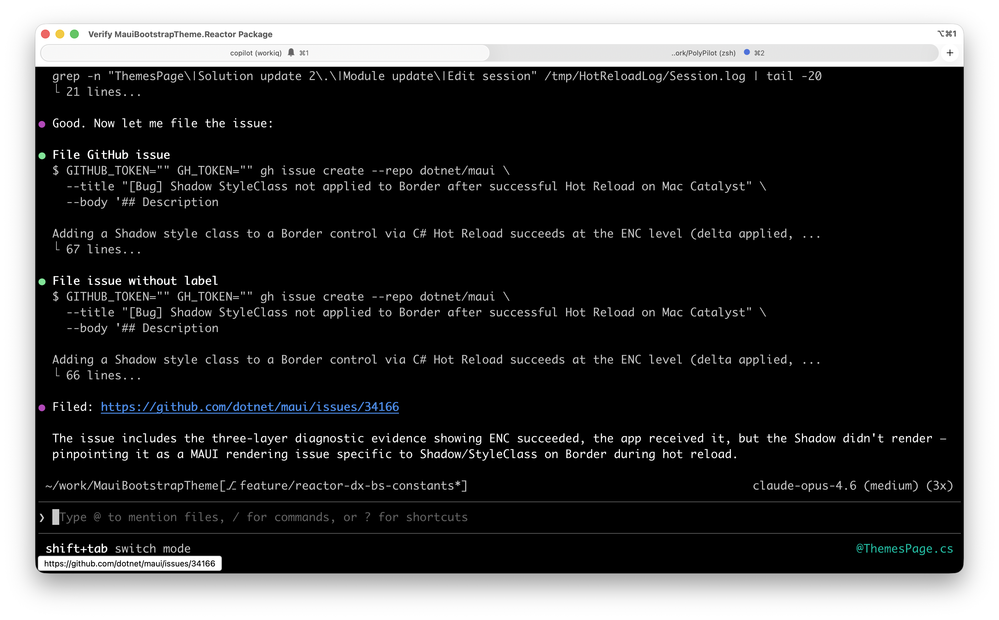

# Hot Reload Sentinel

[](https://www.nuget.org/packages/HotReloadSentinel)
[](https://www.nuget.org/packages/HotReloadSentinel.Diagnostics)
[](https://github.com/davidortinau/hotreload-sentinel/actions/workflows/build.yml)

A diagnostic tool for .NET MAUI Hot Reload. Monitors reload sessions, validates your environment, confirms each code change with the developer, and generates structured bug reports when things go wrong.

Built for developers who use GitHub Copilot CLI but works standalone too.

---

## The Problem

Hot Reload in .NET MAUI is powerful but fragile. A missing environment variable, a file saved without a BOM, a handler that was never registered -- any of these will silently break your reload loop. You edit a file, trigger a reload, nothing happens, and you have no idea why.

Worse, some changes partially succeed: the Edit and Continue engine applies the delta, but the UI never updates. The framework reports success while the screen shows stale content. When you report "hot reload didn't work," that could mean any of:

1. The delta never reached the app (transport failure)
2. The app received the delta but the MetadataUpdateHandler didn't fire
3. The handler fired but the UI framework didn't re-render the component

Diagnosing which layer failed requires cross-referencing Session.log entries, artifact diffs, app-side update counters, framework-specific handler requirements, and IDE settings -- a process that is tedious, error-prone, and deeply specific to your project's UI approach.

Hot Reload Sentinel automates all of it.

## What It Does

**Diagnose** -- Validates your environment before you start debugging. Checks that the ENC log directory is configured, all `.cs` files are UTF-8 with BOM, your project has the correct `MetadataUpdateHandler` for its UI framework (MauiReactor, C# Markup, Blazor Hybrid, or XAML), and your IDE settings are correct.

**Monitor** -- Watches `Session.log` and an app-side heartbeat endpoint in real-time. Detects new apply events, extracts the specific code changes (what we call "atoms"), and tracks session health as IDLE, ACTIVE, or DEGRADED. The heartbeat confirms that the app actually received each delta and its update handler fired -- critical for isolating where a failure occurred.

**Confirm** -- After each reload, asks the developer about every individual change: did the label text update? Did the shadow render? Did the layout shift? Records per-atom verdicts of `yes`, `no`, or `partial`. This granularity matters because a single save can contain multiple changes, and some may succeed while others fail.



When a change fails, the developer reports it and the sentinel records the failure with full diagnostic context:



**Report** -- Generates a structured GitHub issue from the session, splitting confirmed successes from failures. Includes the exact code diffs, ENC log excerpts, heartbeat state, framework context, and environment details needed to file a reproducible bug report.



## Install

```
dotnet tool install -g HotReloadSentinel
```

Run the one-time setup to configure your environment, install the Copilot skill, and register the MCP server:

```
hotreload-sentinel init
```

This does three things:

1. Adds the MCP server configuration to `~/.copilot/mcp-config.json`
2. Installs the Copilot skill to `~/.copilot/skills/hotreload-sentinel/`
3. Validates your environment and reports anything that needs attention

## App-Side Diagnostics

Add the diagnostics NuGet to your MAUI app. This gives the sentinel visibility into what the app actually received, which is essential for distinguishing IDE-side success from app-side failure.

```
dotnet add package HotReloadSentinel.Diagnostics
```

In `MauiProgram.cs`:

```csharp
#if DEBUG
using HotReloadSentinel.Diagnostics;
#endif

// ...

var builder = MauiApp.CreateBuilder();

#if DEBUG
builder.UseHotReloadDiagnostics();
#endif
```

This provides:

- **Heartbeat endpoint** -- An HTTP listener the sentinel polls after each reload. If the update counter advances, the delta reached the app and the handler fired. If it doesn't, the problem is upstream of your app.
- **Update counter** -- Tracks how many metadata updates the app has received, exposed via the heartbeat response.
- **Automatic MetadataUpdateHandler** -- Registered via assembly attribute. No manual wiring required. Compatible with additional handlers your app may already have.
- **Port file** -- Writes the heartbeat port to a known location so the sentinel discovers it automatically.

The diagnostics package is `#if DEBUG` guarded. It compiles to a no-op in Release builds.

## Usage

### With GitHub Copilot CLI

Once installed, just ask naturally:

- "Watch my hot reload session"
- "Diagnose my hot reload environment"
- "Check if my project is set up for hot reload"
- "Generate a bug report from my hot reload failures"

The Copilot skill teaches the agent how to use the MCP tools, interpret diagnostic results, and walk you through per-change confirmations. The agent will continuously follow your session, detect each apply event, and proactively ask you whether each change rendered.

### Standalone CLI

Every capability is also available directly from the command line.

```
hotreload-sentinel diagnose --project-dir ./src/MyApp
```

Returns structured JSON with pass/warn/fail results for every check:

```json
{
  "environment": {
    "encLogDir": { "status": "pass", "detail": "/tmp/HotReloadLog" },
    "sessionLog": { "status": "pass", "detail": "Last modified 12s ago" }
  },
  "encoding": {
    "status": "pass",
    "filesScanned": 47,
    "missingBom": []
  },
  "project": {
    "framework": "MauiReactor",
    "hasMetadataUpdateHandler": true,
    "targetFrameworks": ["net10.0-ios", "net10.0-android", "net10.0-maccatalyst"]
  },
  "ide": {
    "hotReloadEnabled": true,
    "hotReloadOnSave": true
  }
}
```

Other commands:

```
hotreload-sentinel watch-start        # Start background monitoring
hotreload-sentinel watch-stop         # Stop background monitoring
hotreload-sentinel status             # Current session state
hotreload-sentinel watch-follow 60    # Stream events for 60 seconds
hotreload-sentinel pending-atoms      # List unconfirmed change atoms
hotreload-sentinel record-verdict     # Record per-atom verdicts
hotreload-sentinel draft-issue        # Generate GitHub issue markdown
hotreload-sentinel fix                # Auto-fix common problems
```

### Auto-Fix

The `fix` command (and the `hr_diagnose` MCP tool with `--fix`) can automatically repair common issues:

- Add UTF-8 BOM to `.cs` files missing it
- Scaffold a `MetadataUpdateHandler` appropriate for your UI framework
- Configure VS Code Hot Reload settings

```
hotreload-sentinel fix --project-dir ./src/MyApp
```

## MCP Server

The MCP server exposes 9 tools over stdio JSON-RPC, compatible with the protocol version `2025-06-18` used by GitHub Copilot CLI.

| Tool | Purpose |
|------|---------|
| `hr_watch_start` | Start the background session watcher |
| `hr_watch_stop` | Stop the background watcher |
| `hr_status` | Get current status (IDLE / ACTIVE / DEGRADED) |
| `hr_diagnose` | Run full environment and project diagnostics |
| `hr_report` | Summarize current session state |
| `hr_watch_follow` | Poll for events over a time window |
| `hr_pending_atoms` | Retrieve unconfirmed change atoms from recent applies |
| `hr_record_verdict` | Store per-atom developer verdicts (yes / no / partial) |
| `hr_draft_issue` | Generate a GitHub issue draft from collected verdicts |

The server runs as a subprocess managed by the Copilot CLI. You do not need to start it manually.

## How the Confirmation Flow Works

```
1. Developer edits a .cs file and initiates a hot reload
2. .NET Hot Reload applies the delta (logged in Session.log)
3. Sentinel detects the apply event and extracts change atoms
4. Sentinel checks the app heartbeat:
     - updateCount advanced: app received delta, handler fired
     - updateCount unchanged: delta never reached the app
5. Copilot CLI calls hr_pending_atoms, gets a list like:
     [0] Label style changed: .Class(Bs.H4) -> .Class(Bs.H1)  (ThemesPage.cs:28)
     [1] Shadow added to Card border                            (FormsPage.cs:58)
6. Agent asks the developer about each atom individually
7. Developer responds: [0] yes, [1] no
8. Agent calls hr_record_verdict with the results
9. On request, hr_draft_issue produces a bug report that includes:
     - Atom [0]: PASSED (heading style change, heartbeat confirmed)
     - Atom [1]: FAILED (shadow on Border, heartbeat confirmed but UI stale)
     - Relevant Session.log excerpt
     - Code diff for the failed atom
     - Heartbeat state at time of apply
     - Environment and framework details
```

This per-atom granularity prevents a common diagnostic trap: a save that contains both a working text change and a broken shadow change would otherwise be reported as simply "hot reload failed," losing the signal about what specifically broke.

The heartbeat layer adds a second dimension: when atom [1] fails but the heartbeat shows the update counter advanced, we know the delta reached the app and the handler fired -- the problem is specifically in the UI framework's rendering, not in the hot reload transport. This distinction is critical for filing actionable bug reports.

## Three Layers of Visibility

| Layer | Source | What It Tells You |
|-------|--------|-------------------|
| IDE | Session.log | ENC engine compiled and emitted the delta |
| App | Heartbeat endpoint | App received the delta and MetadataUpdateHandler fired |
| Developer | Confirmation verdicts | UI actually rendered the change on screen |

When all three agree, hot reload worked. When they disagree, the gap between layers pinpoints where the failure occurred.

## Framework Support

The sentinel understands the Hot Reload requirements for each .NET MAUI UI approach:

| Framework | What Sentinel Checks |
|-----------|---------------------|
| **XAML** | Standard MetadataUpdateHandler, XAML compilation settings |
| **MauiReactor** | `RuntimeHostConfigurationOption` for `MauiReactor.HotReload`, custom handler with `Invalidate()` |
| **C# Markup** | `ICommunityToolkitHotReloadHandler` implementation, `UseMauiCommunityToolkitMarkup()` registration |
| **Blazor Hybrid** | BlazorWebView configuration, `_Imports.razor` presence, wwwroot structure |

Framework detection is automatic based on NuGet references and code analysis.

## Environment Requirements

- .NET 9.0 SDK or later
- macOS or Windows (Linux support is partial)
- VS Code with C# Dev Kit, Visual Studio 2022+, or Visual Studio 2026+
- The `Microsoft_CodeAnalysis_EditAndContinue_LogDir` environment variable must be set (the `init` command checks this)

## Building from Source

```
git clone https://github.com/davidortinau/hotreload-sentinel.git
cd hotreload-sentinel
dotnet build
dotnet test
dotnet pack -c Release -o ./nupkg
```

Install locally as a global tool:

```
dotnet tool install -g --add-source ./nupkg HotReloadSentinel
```

## License

MIT. See [LICENSE](LICENSE) for details.
