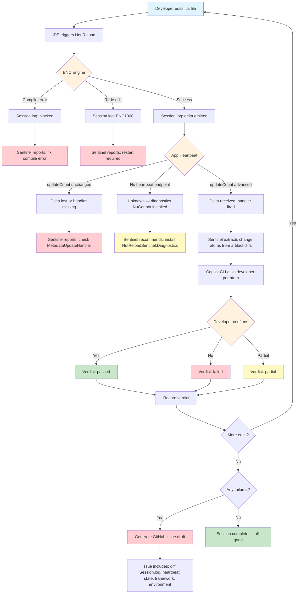

```mermaid
flowchart TD
    A[Developer edits .cs file] --> B[IDE triggers Hot Reload]
    B --> C{ENC Engine}
    C -->|Compile error| D[Session.log: blocked]
    C -->|Rude edit| E[Session.log: ENC1008]
    C -->|Success| F[Session.log: delta emitted]

    D --> Z1[Sentinel reports: fix compile error]
    E --> Z2[Sentinel reports: restart required]

    F --> G{App Heartbeat}
    G -->|updateCount advanced| H[Delta received, handler fired]
    G -->|updateCount unchanged| I[Delta lost or handler missing]
    G -->|No heartbeat endpoint| J[Unknown — diagnostics NuGet not installed]

    I --> Z3[Sentinel reports: check MetadataUpdateHandler]
    J --> Z4[Sentinel recommends: install HotReloadSentinel.Diagnostics]

    H --> K[Sentinel extracts change atoms from artifact diffs]
    K --> L[Copilot CLI asks developer per atom]

    L --> M{Developer confirms}
    M -->|Yes| N[Verdict: passed]
    M -->|No| O[Verdict: failed]
    M -->|Partial| P[Verdict: partial]

    N --> Q[Record verdict]
    O --> Q
    P --> Q

    Q --> R{More edits?}
    R -->|Yes| A
    R -->|No| S{Any failures?}

    S -->|Yes| T[Generate GitHub issue draft]
    S -->|No| U[Session complete — all good]

    T --> V[Issue includes: diff, Session.log, heartbeat state, framework, environment]

    style A fill:#e1f5fe
    style C fill:#fff3e0
    style G fill:#fff3e0
    style M fill:#fff3e0
    style N fill:#c8e6c9
    style O fill:#ffcdd2
    style P fill:#fff9c4
    style T fill:#ffcdd2
    style U fill:#c8e6c9
    style Z1 fill:#ffcdd2
    style Z2 fill:#ffcdd2
    style Z3 fill:#ffcdd2
    style Z4 fill:#fff9c4
```
